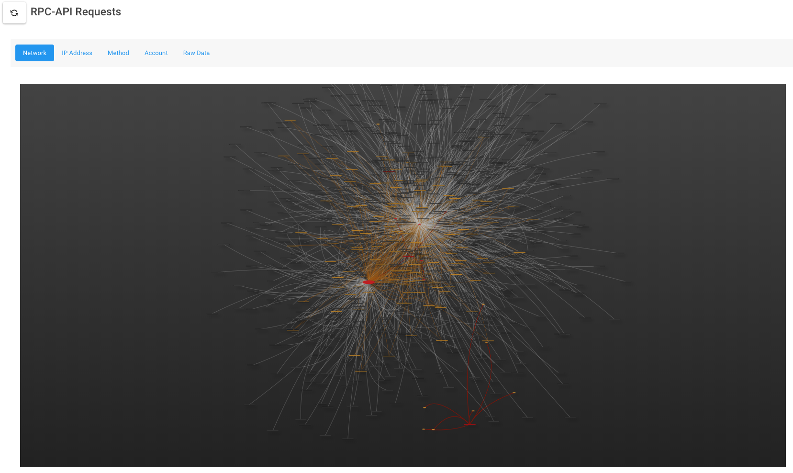

# Honeywallet

**This is pretty outdated and not likely to work anymore, but I'll keep it around for historical reference**

This a tool for logging attacks against a
publicly accessible geth API endpoint. 

The honeywallet is a product of the 2019 ethdenver hackathon. It will 
start a geth daemon, a proxy that rewrites several rpc-api
calls to geth to fake an unlocked wallet, logs the incoming
attacks, and has a simple dashboard showing the data.

### Exposed Ports:
* 30303 - ethereum p2p network
* 8545 - goproxy -> geth rpc api
* 80 - nginx stats dashboard (configured to only allow local nets)

### Containers:
* goproxy: lightweight logging/rewriting proxy for geth rpc-api
* stats: minimal vue2 app for showing summary of activity
* geth: Dockerfile for geth node

### Requires:
* docker
* docker-compose
* will mount geth data, and stats files at `/opt/honeywallet`

### Technology stack:
* goproxy: golang
* stats: bootstrap-vue and vis.js

### Running:
Can be brought up using `run.sh` in this directory

This software is made available under the _MIT License_ please see
the `LICENSE` file for details.
